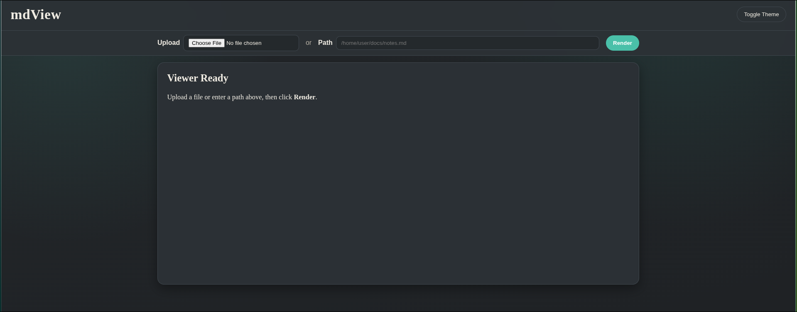
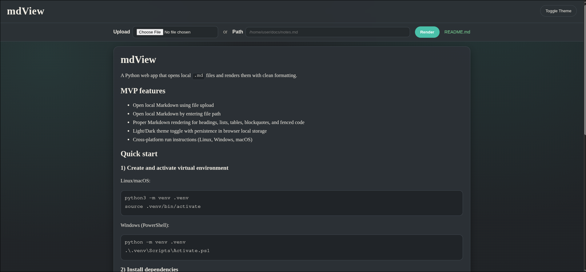

# mdView

A Python web app that opens local `.md` files and renders them with clean formatting.

## MVP features

- Open local Markdown using file upload
- Open local Markdown by entering file path
- Proper Markdown rendering for headings, lists, tables, blockquotes, and fenced code
- Light/Dark theme toggle with persistence in browser local storage
- Docker Compose workflow for consistent startup

## Screenshots

### Viewer UI



### Rendered view



## Quick start

Run the app with Docker Compose:

```bash
docker compose up --build
```

Then open `http://127.0.0.1:5000` in your browser.

Stop the app with:

```bash
docker compose down
```

Docker notes:

- File upload works normally in Docker.
- Path-based loading works for files available inside the container. With the default Compose setup, the project folder is mounted at `/app`, so you can load files like `/app/samples/example.md`.

## Local development without Docker

Create and activate a virtual environment:

Linux/macOS:

```bash
python3 -m venv .venv
source .venv/bin/activate
```

Windows (PowerShell):

```powershell
python -m venv .venv
.\.venv\Scripts\Activate.ps1
```

Install dependencies:

```bash
pip install -r requirements.txt
```

Run the app:

```bash
python run.py
```

Then open `http://127.0.0.1:5000` in your browser.

Run tests:

```bash
pytest -q
```

## Behavior

- Only `.md` files are accepted.
- Files are expected to be UTF-8 encoded.
- HTML output is sanitized before rendering.
